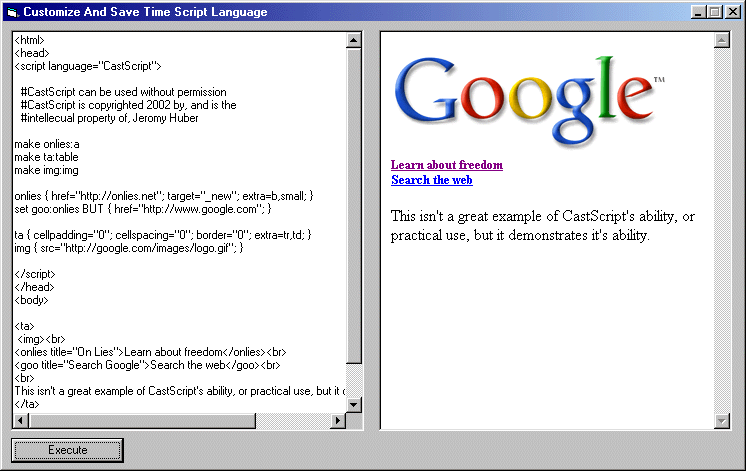



## CastScript

### Description

The Customize And Save Time Scripting language is used along the same lines as JavaScript; it is embedded in the HTML code. The script defines tags and their properties, then implants them into the HTML source via the tags' name. I was constantly getting tired of continually writing and and re-writing the same lines of code in HTML; and I wondered how I could use a scripting language to define tags that could be reused over and over again. CastScript is what I came up with.
 
### More Info
 

             |
---                |---
**Submitted On**   |2002-03-02 11:28:50
**By**             |[DoWnLoHo](https://github.com/Planet-Source-Code/PSCIndex/blob/master/ByAuthor/downloho.md)
**Level**          |Intermediate
**User Rating**    |4.8 (24 globes from 5 users)
**Compatibility**  |VB 6\.0
**Category**       |[Internet/ HTML](https://github.com/Planet-Source-Code/PSCIndex/blob/master/ByCategory/internet-html__1-34.md)
**World**          |[Visual Basic](https://github.com/Planet-Source-Code/PSCIndex/blob/master/ByWorld/visual-basic.md)
**Archive File**   |[CastScript58829322002\.zip](https://github.com/Planet-Source-Code/downloho-castscript__1-32267/archive/master.zip)

